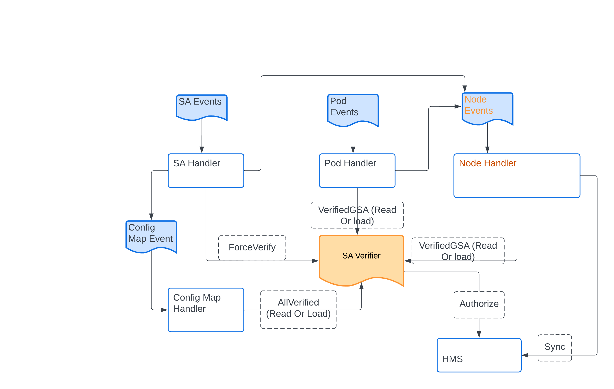

This directory dpwi is short for Direct Path (via [ALTS](https://cloud.google.com/docs/security/encryption-in-transit/application-layer-transport-security)) integration with [Workload Identity](https://cloud.google.com/kubernetes-engine/docs/concepts/workload-identity). It's the control plane that provisions ALTS credentials on the nodes.

It
* listens to events of pods, service accounts, config maps, nodes
* verifies if a KSA (Kubernetes Service Account) can act as a GSA (Google Service Account)
* extracts all verified GSAs on a node and calls HMS to Sync. Down-streams will mint the credentials on the node.

Below is the system graph and a brief introduction about how each component works.
 # System graph

## SA Verifier
This is a key component that it interacts with all other handlers.

It can verify if a KSA can act as a GSA by calling HMS and store the allowed/denied result. Since there can be many concurrent calls, we can use singleflight to minimize the calls to HMS.

It provides 3 APIs
* ForceVerify(ksa) - Get the annotated GSA. If GSA is not empty, call HMS to verify the permission no matter if it has been verified or not. Store the result.
Only SA Event Handler calls this API.

* VerifiedGSA(ksa) - If it has the result locally, use it. Otherwise, call HMS to verify it.
This is for the Pod event handler and the node sync event handler.

* AllVerified() - For all KSAs, call VerifiedGSA. Get a full list of verified ksa/gsa pairs.
This is for the config map event handler.

## SA Event Handler
It listens to KSA events and forces the SA verifier to re-verify permissions. We can keep the current 30 re-sync logic so that each KSA can be re-verified every 30 minutes.

One the permission changes, it will notify config map handler. It will also
notify the node handler with all related nodes, where there're one or more pods running as the KSA.

Since the IAM propagation can take up to 7 minutes, we will retry SA event if it’s denied.

## Pod Event Handler
If the pod’s KSA can act as a GSA (by calling the SA verifier), it triggers a node event.

## Node Event Handler
For a node event, it iterates all pods on the node, makes sure each pod is verified, collects the complete list of GSAs and calls HMS to Sync.

We use workqueue to store the events, so if there’re many concurrent events for the same node, they will be collapsed into one.

It can remember the last SyncNode request, so that it can avoid sending duplicate requests if it’s the same as the last one.

We can put some internals (10 seconds) between 2 requests to avoid overwhelming
down-streams.

## Config Map Event Handler
Config Map Event Handler makes sure that the cluster’s config map (verified-ksa-to-gsa) is in sync.

It first gets the completed verified SA list from the SA verifier. It compares it with the cluster’s config map. If they are different, create/update the cluster’s config map.
