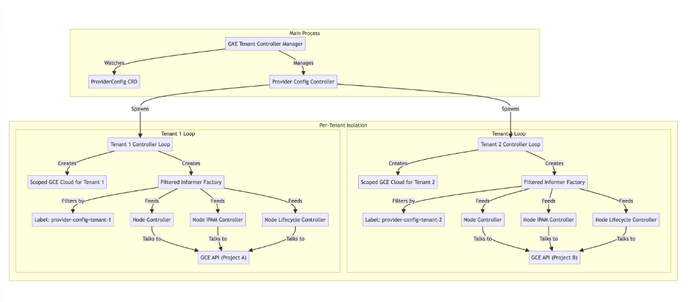

# GKE Tenant Controller Manager

This package (`gketenantcontrollers`) implements the core logic for the **GKE Tenant Controller Manager**, a component designed to run isolated, provider-config-scoped controller loops within a multi-project environment.

## Overview

The GKE Tenant Controller Manager operates as a "manager of controllers." Instead of running a single set of controllers (like the standard `cloud-controller-manager`), it watches for `ProviderConfig` custom resources. For each `ProviderConfig` (representing a project or a specific configuration), it spawns a dedicated set of controllers (e.g., Node Controller, Node IPAM Controller) that operate *only* on the resources belonging to that project.

### Key Features
- **Multi-Project**: Runs independent controller loops for each provider config.
- **Resource Isolation**: Uses a filtered informer factory to ensure each controller only sees nodes associated with its `ProviderConfig`.
- **Scoped Cloud Provider**: Creates a unique `cloudprovider.Interface` for each tenant, using the specific project ID, network, and credentials defined in the `ProviderConfig`.

## Architecture

1.  **Entry Point**: The main entry point is `cmd/cloud-controller-manager/gketenantcontrollermanager.go`.
2.  **Manager Framework**: A framework watches `ProviderConfig` resources.
3.  **Controller Starter**: When a `ProviderConfig` is reconciled, the `NodeControllerStarter` (in `starter.go`):
    - Creates a **provider-config-scoped GCE Cloud** object.
    - Creates a **filtered shared informer factory** that filters resources by the label `tenancy.gke.io/provider-config=<ProviderConfig.Name>`.
    - Starts the registered controllers.
4.  **Controllers**: Each controller (e.g., Node Controller) runs in its own goroutine, isolated from others.

### Architecture Diagram



## How to Add a New Controller

To add a new provider-config-scoped controller, you need to register it in the main entry point.

1.  **Implement the Controller**: Ensure your controller can accept a `cloudprovider.Interface`, a `clientset.Interface`, and a `corev1.NodeInformer` (or other informers available in the filtered factory).
2.  **Register the Controller**:
    - Open `cmd/cloud-controller-manager/gketenantcontrollermanager.go`.
    - Locate the `controllers` map in the `startGKETenantControllerManager` function.
    - Add a new entry with your controller's name and a start function.

**Example Registration:**

```go
"my-new-controller": func(cfg *gketenantcontrollers.ControllerConfig) error {
    klog.Infof("Starting My New Controller for %s...", cfg.ProviderConfig.Name)
    
    // Initialize your controller
    myController := mypkg.NewController(
        cfg.KubeClient,
        cfg.NodeInformer,
        cfg.Cloud,
    )
    
    // Run it (blocking until context is done, or in a goroutine if the Run method blocks)
    // The wrapper in starter.go runs this function in a goroutine, so blocking is fine/expected.
    myController.Run(cfg.Context.Done())
    
    return nil
},
```

## Important Notes for Contributors

-   **Strict Isolation**: All controllers **must** use the provided `cfg.NodeInformer` and `cfg.Cloud`. **Never** use the global informer factory or the global cloud provider associated with the CCM itself, as this breaks multi-project isolation.
-   **Filtered Informers**: The `filteredSharedInformerFactory` (`pkg/controller/gketenantcontrollers/filteredfactory.go`) currently supports `Nodes`, `Services` (if needed), and `Leases`. If your new controller needs access to other resources (e.g., `Pods`), you must update the filtered factory to support them *and ensure they are correctly filtered by the provider config label*.
-   **Context Management**: When a `ProviderConfig` is deleted, `cfg.Context` is canceled. Your controller must stop promptly to avoid leaking resources.
-   **Concurrency**: A separate instance of your controller runs for *every* `ProviderConfig`. Ensure your controller is lightweight and efficient.
